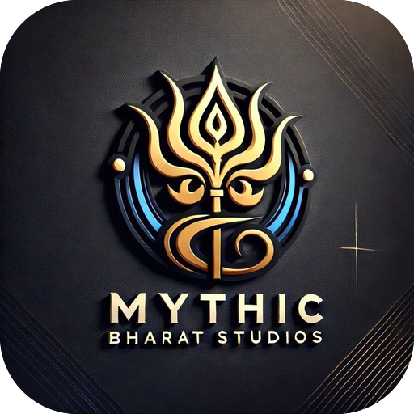
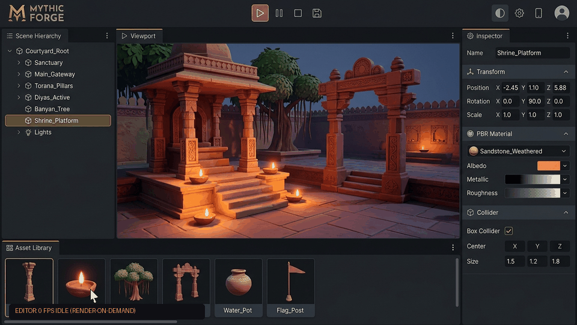
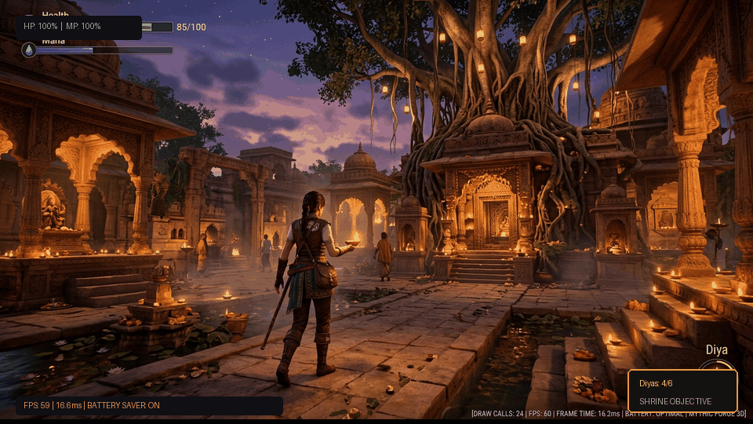
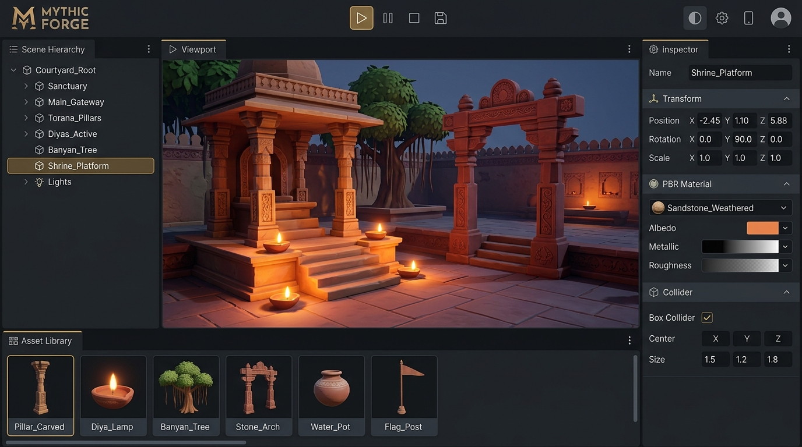
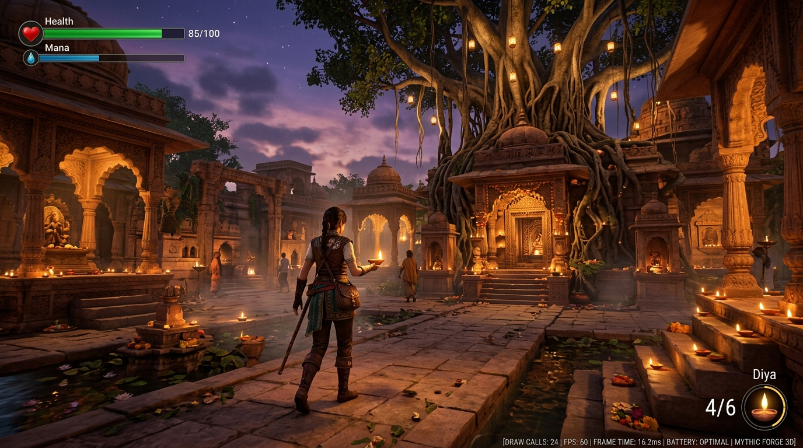

<p align="center">
  
</p>

<h1 align="center">MYTHIC FORGE</h1>

<p align="center">
  <strong>Produced by Mythic Bharat Studios</strong><br />
  <em>Create. Build. Play. — A powerful creation engine that respects the device.</em>
</p>

<p align="center">
  <a href="docs/testing.md">
    
  </a>
  <a href="LICENSE.md">
    
  </a>
  <a href="#9-about-mythic-bharat-studios">
    
  </a>
  <a href="#direct-downloads">
    
  </a>
</p>

<p align="center" id="direct-downloads">
  <a href="https://github.com/piyushmali61/mythic-forge/raw/main/downloads/MythicForge-Mobile-v0.1.0.apk">
    
  </a>
  &nbsp;&nbsp;
  <a href="https://github.com/piyushmali61/mythic-forge/raw/main/downloads/MythicForge-Windows-x64-v0.1.0.zip">
    
  </a>
</p>

<p align="center">
  <em>⚡ Works fully offline. The Windows edition is portable (unzip and run <code>MythicForge.exe</code>).<br />The APK is a debug-signed test build: allow installs from this source on your phone.</em>
</p>

---

<p align="center">
  
</p>
<p align="center">
  <em>Real-time 3D viewport, scene hierarchy, entity inspector, and instant play mode switch.</em>
</p>

---

## 1. Overview

**Mythic Forge** is a lightweight, beginner-friendly, cross-platform 3D creation and game engine designed from the ground up for students, indie developers, creators, and enthusiasts.

Unlike traditional game engines that require high-end desktop hardware, consume gigabytes of disk space, and drain laptop or mobile batteries within hours, Mythic Forge is architected around the hierarchy:
$$\text{PHONE} \longrightarrow \text{LAPTOP} \longrightarrow \text{PC}$$

It delivers a smooth, professional 3D authoring experience while prioritizing:
- **Low Battery Consumption:** Render-on-demand editor draws **0 FPS when idle**, dropping CPU and GPU load to zero.
- **Low Memory & Footprint:** a 6.4 MB APK and a 1.7 MB Windows download. The memory budget is 150 MB on phones with the demo open (see [performance.md](docs/performance.md)).
- **100% Offline-First:** Fully functional without internet connectivity.
- **Strict Legal Licensing:** Every bundled asset is verified against a 10-point distribution gate.
- **Cross-Platform Portability:** Portable `.mfpack` container transfers projects seamlessly between Android phones, tablets, laptops, and desktop PCs.

---

## 2. Visual Showcase & Video Clips

### 🎬 Interactive 3D Editor Tour
Experience zero-battery idle draw (0 FPS render-on-demand), responsive gizmos, and asset placement:

<p align="center">
  
</p>

- 📹 **Full Video Clip:** [`docs/assets/editor-tour.mp4`](docs/assets/editor-tour.mp4) (High-definition MP4 clip)
- 🖼️ **Full-Resolution Capture:** [`docs/assets/editor-preview.jpg`](docs/assets/editor-preview.jpg)

### 🎮 Real-Time Gameplay & Physics Mode
One-click switch to real-time 60 FPS gameplay, dynamic diya lighting, player controller, and battery-aware telemetry:

<p align="center">
  
</p>

- 📹 **Full Video Clip:** [`docs/assets/gameplay-demo.mp4`](docs/assets/gameplay-demo.mp4) (High-definition MP4 clip)
- 🖼️ **Full-Resolution Capture:** [`docs/assets/gameplay-preview.jpg`](docs/assets/gameplay-preview.jpg)

### 📸 High-Resolution Engine Captures

| 3D Authoring Environment | In-Game Play Mode |
| :---: | :---: |
| [](docs/assets/editor-preview.jpg) | [](docs/assets/gameplay-preview.jpg) |

---

## 3. Key Features

- **Project Manager & Wizard:** Create, duplicate, archive, import, and export projects with customizable templates (Basic 3D, Platformer, Third Person, First Person, Shrine of Lamps).
- **3D Scene Editor:** Clean, responsive workspace featuring scene hierarchy trees, transform gizmos (Move, Rotate, Scale), camera controls (Orbit, Fly, Pan, Touch gestures), and entity inspectors.
- **Built-in 3D Primitives & PBR Materials:** Instantly spawn Cubes, Spheres, Cylinders, Capsules, Planes, Directional Lights, Point Lights, and Ambient Lights.
- **Model Import Pipeline:** Import and optimize external GLB, glTF, OBJ, WebP, PNG, JPEG, and audio assets with real-time geometry analysis and bounding box calculation.
- **Curated Asset Libraries:**
  - **Official Mythic Bharat Studios Library:** Original in-house Indian architecture, temples, carved pillars, torana gateways, and glowing diya lamps (`MBS-ASSET-1.0`).
  - **Free & Open Library:** Verified CC0 1.0 public domain game starter models (rocks, wooden crates, ground tiles, earthenware urns) and PBR materials.
- **Instant Play Mode:** Switch seamlessly between Editor and Play Mode with declarative behaviours (`rotate`, `bob`, `playerController`, `followCamera`, `collectible`) and simple rigid-body physics.
- **Battery-First Power Management:** Automatically suspends rendering when backgrounded; features a dedicated Battery Saver profile ($30\text{ FPS}$, reduced shadows) and native Android thermal management integration.
- **Web Export & PWA Support:** Export projects as standalone, self-contained HTML/JS games, or install Mythic Forge directly as an offline Progressive Web App.

---

## 4. Quickstart Guide

### Prerequisites
- **Node.js:** $\ge 22.18$
- **npm:** $\ge 10.0$

### Setup & Development
```bash
# Clone the repository
git clone https://github.com/piyushmali61/mythic-forge.git
cd mythic-forge

# Install dependencies
npm ci

# Start the local development editor (http://localhost:5173)
npm run dev
```

### Verification & Testing
```bash
# Run TypeScript compilation checks
npm run typecheck

# Run full Vitest test suite (142+ unit & integration tests)
npm test

# Audit asset license verification and publication gates
npm run audit:licenses

# Generate and verify procedural asset packs
npm run assets:generate

# Run platform-independent core performance benchmark
npm run bench:core

# Run comprehensive pre-commit check
npm run check
```

### Production Build
```bash
# Web build: editor + player bundles + the downloads/ folder (apps/editor/dist)
npm run build

# App build for the Android / Windows / Tauri shells (same, without downloads/)
npm run build:app

# Preview production build locally (http://localhost:4173)
npm run preview
```

---

## 5. Platform Targets

### A. Android (Capacitor Shell)
Hosted in `apps/android`:
- **Shell:** Capacitor 8 wrapper around the app build (`npm run build:app`).
- **Thermal Management:** Native Java plugin (`ThermalStatusPlugin.java`) bridges `PowerManager` thermal status to the engine.
- **Permissions:** Minimal install-time `INTERNET` permission; zero runtime permissions requested.
- **Build APK:**
  ```bash
  npm run android:sync
  cd apps/android/android
  ./gradlew assembleDebug
  cd ../../..
  npm run package:android   # copies the APK to downloads/
  ```
- **Tested:** Android 17 emulator. Real-device testing is still to do. See [docs/android.md](docs/android.md#6-verified-on).

### B. Windows
- **Portable edition (available now):** `MythicForge.exe` is a 190 KB C# launcher (`tools/desktop/Launcher.cs`). It serves the app on `127.0.0.1:47831` and opens it in a Microsoft Edge app window with its own profile. No installer and no admin rights are needed.
  ```bash
  python tools/desktop/package-windows.py   # builds and writes downloads/MythicForge-Windows-x64-v0.1.0.zip
  ```
- **Tauri 2 shell (`apps/desktop`, not built or tested yet):** a native WebView2 window with NSIS/MSI installers. Building it needs the Rust toolchain; see [docs/windows.md](docs/windows.md#4-tauri-build-not-yet-verified).

### C. Web / PWA
- Supported out-of-the-box in modern browsers with WebGL 2 support.
- Fully offline capable via Service Worker (`sw.js`). The standalone downloads are offered only here and are never precached.

---

## 6. Repository Architecture

```
mythic-forge/
├── apps/
│   ├── editor/         # Preact UI (Home, Wizard, Editor, Library, Settings, Docs)
│   ├── android/        # Capacitor Android shell with native ThermalStatus plugin
│   └── desktop/        # Tauri 2 Windows desktop shell configuration
├── packages/
│   ├── core/           # Headless engine core (scene, project store, math, security, perf)
│   ├── renderer/       # Three.js WebGL 2 viewport, render-on-demand loop, gizmos
│   └── platform/       # IndexedDB filesystem, Capacitor lifecycle, Web battery adapters
├── assets/
│   ├── official/       # In-house Mythic Bharat Studios catalog (MBS-ASSET-1.0)
│   ├── free-open/      # Public-domain CC0 1.0 catalog
│   └── licenses/       # Preserved full legal texts
├── downloads/          # Standalone Android APK and Windows portable zip (served by the web build)
├── examples/           # Reference demo project (Shrine of Lamps) and .mfpack archives
├── tools/              # Verification, benchmark, icon, and asset generation scripts
└── docs/               # Comprehensive subsystem architectural documentation
```

---

## 7. Subsystem Documentation

For deep technical specifications, refer to the documentation in `docs/`:

- [Architecture Specification](docs/architecture.md)
- [Project Format & .mfpack Specification](docs/project-format.md)
- [Asset Pipeline & Catalog Specification](docs/asset-system.md)
- [Rendering Engine & Graphics Specification](docs/rendering.md)
- [Performance Budgets & Adaptive Governor](docs/performance.md)
- [Battery Optimization & Power Management](docs/battery.md)
- [Licensing, Provenance & Audit Pipeline](docs/licensing.md)
- [Security Model & Untrusted Input Sanitization](docs/security.md)
- [Android Platform Architecture & Thermal Plugin](docs/android.md)
- [Windows & Desktop Architecture](docs/windows.md)
- [Testing Strategy & Quality Assurance](docs/testing.md)
- [Google Play Store Readiness Checklist](docs/play-store-checklist.md)
- [Contributor Guide & Standards](docs/contributing.md)

---

## 8. Licensing & Attribution

- **Mythic Forge Engine:** © 2026 Mythic Bharat Studios. All rights reserved. See [LICENSE.md](LICENSE.md) for full proprietary terms. Unauthorized copying, modification, or commercial redistribution of the engine source code is strictly prohibited.
- **User Project Ownership:** Users retain full copyright and ownership of the original games, assets, and experiences created using Mythic Forge.
- **Official Assets:** Licensed under `MBS-ASSET-1.0` (free for use in personal & commercial projects made with Mythic Forge).
- **Free & Open Assets:** Dedicated to the public domain under Creative Commons `CC0-1.0` ([assets/licenses/CC0-1.0.md](assets/licenses/CC0-1.0.md)).
- **Third-Party Open-Source Components:** Permissively licensed (MIT / Apache-2.0). Complete notices and copyright statements are preserved and documented in [THIRD_PARTY_NOTICES.md](THIRD_PARTY_NOTICES.md).

---

## 9. About Mythic Bharat Studios

<p align="center">
  
</p>

**Mythic Bharat Studios** is an independent technology and creative studio pioneering accessible, culturally-inspired, and performance-optimized 3D game engines, interactive simulations, and digital experiences.

- **Brand:** Mythic Bharat Studios
- **Product:** Mythic Forge — *Create. Build. Play.*
- **Philosophy:** A powerful creation engine that respects the device.
- **Repository:** [https://github.com/piyushmali61/mythic-forge](https://github.com/piyushmali61/mythic-forge)
- **Official Contact & Releases:** Hosted on GitHub.

