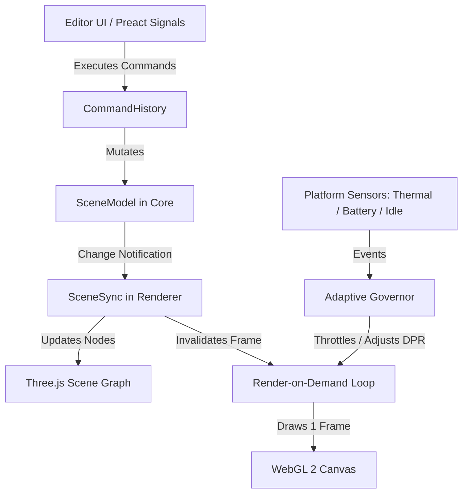

# Mythic Forge — Architecture Specification

## 1. Executive Summary & Core Philosophy

**Mythic Forge** is a lightweight, cross-platform 3D creation and game engine by **Mythic Bharat Studios** built under the product positioning:
> **Mythic Forge — Create. Build. Play.**  
> *"A powerful creation engine that respects the device."*

The architecture is deliberately structured around the hardware hierarchy:
$$\text{PHONE} \longrightarrow \text{LAPTOP} \longrightarrow \text{PC}$$

Unlike heavyweight engines that demand discrete desktop GPUs, massive gigabyte installations, and continuous high-draw render loops, Mythic Forge achieves professional performance through strict subsystem isolation, render-on-demand loops, event-driven background suspension, and zero-overhead data pipelines.

---

## 2. Monorepo Structure & System Separation (§91)

The codebase strictly decouples the Editor, Runtime, Asset System, Rendering, Platform Layer, and Project Management:

```
mythic-forge/
├── packages/
│   ├── core/           # Pure TypeScript engine core. NO DOM, NO WebGL, NO Three.js.
│   │   ├── assets/     # Metadata, licence gate (§15), review workflow, catalogs, downloads
│   │   ├── commands/   # Transactional CommandHistory (Undo/Redo) with bounded memory
│   │   ├── log/        # Structured logging with verbosity levels and exportable diagnostics
│   │   ├── math/       # Lightweight vector (Vec3), quaternion (Quat), matrix (Mat4) math
│   │   ├── perf/       # Device tiers, quality profiles, adaptive governor, frame scheduler
│   │   ├── platform/   # Abstract FileSystem, Dialogs, Share, and Network interfaces
│   │   ├── project/    # ProjectStore, manifest schemas, migrations, and .mfpack pack/unpack
│   │   ├── runtime/    # GameRuntime: tick loop, behaviour execution, simple physics
│   │   ├── scene/      # Entity-component scene graph, primitives, camera, lights, templates
│   │   ├── search/     # In-memory tokenized local search index
│   │   ├── security/   # Magic-byte sniffers, zip-bomb defense, path traversal sanitizers
│   │   ├── settings/   # Engine configuration defaults & schema
│   │   └── util/       # UUID generation, byte hashing, JSON stream limiters
│   │
│   ├── renderer/       # Real-time graphics backend using Three.js WebGL 2.
│   │   ├── viewport.ts # Render-on-demand loop, canvas management, devicePixelRatio scaling
│   │   ├── scene-view.ts # Bidirectional sync between Core SceneModel and Three.js hierarchy
│   │   ├── camera-controller.ts # Orbit / Fly / Pan camera with touch gesture decoding
│   │   ├── primitives.ts # Geometry generators for cube, sphere, cylinder, capsule, plane
│   │   ├── thumbnails.ts # Offscreen headless thumbnail renderer with WebP export
│   │   └── assets/     # GLB/glTF, OBJ/MTL, image, and texture loaders & caches
│   │
│   └── platform/       # Concrete platform adapters.
│       ├── web/        # IndexedDB FileSystem, BatteryManager API, Compute Pressure API
│       └── capacitor/  # Android lifecycle listeners, native ThermalStatus bridge, System Share
│
├── apps/
│   ├── editor/         # Preact-based cross-platform Editor UI.
│   │   ├── src/app/    # State management via @preact/signals, routing, service bootstrap
│   │   ├── src/editor/ # HierarchyPanel, InspectorPanel, AssetsPanel, ConsolePanel, Viewport
│   │   ├── src/screens/# Home, NewProject wizard, Asset Library, Templates, Settings, Docs
│   │   ├── src/player/ # Lightweight standalone web runtime bundled into exported games
│   │   └── public/     # Offline Service Worker (sw.js), web app manifest, icons, catalogs
│   │
│   ├── android/        # Android Capacitor 8 shell.
│   │   └── android/    # Native Gradle project, AndroidManifest.xml, ThermalStatusPlugin.java
│   │
│   └── desktop/        # Tauri 2 Windows desktop shell configuration.
│       └── src-tauri/  # Rust native wrapper hosting WebView2
│
├── assets/             # Curated, legally verified offline asset catalogs.
│   ├── official/       # In-house assets under MBS-ASSET-1.0 (Indian architecture, props)
│   ├── free-open/      # Public domain CC0-1.0 procedural assets
│   └── licenses/       # Preserved full legal texts (MBS-ASSET-1.0.md, CC0-1.0.md)
│
├── examples/           # Reference demo projects and portable .mfpack archives.
└── tools/              # Verification, benchmark, icon, and asset compilation scripts.
```

### Critical Architectural Boundary Rules
1. **Zero Core Dependencies on Rendering/DOM:** `@mythic-forge/core` must compile and execute in pure Node.js environments. It has no references to `window`, `document`, `HTMLCanvasElement`, or `THREE`.
2. **Platform Inversion:** Operating system capabilities (filesystems, network status, battery signals, dialogs) are exposed to Core exclusively through interfaces defined in `core/src/platform/`.
3. **Uni-directional Data Flow:** The Editor UI modifies the `SceneModel` via `CommandHistory`. Changes emit signals that notify `@mythic-forge/renderer` to update Three.js scene nodes and trigger a single render frame.

---

## 3. Communication & Synchronization Architecture



---

## 4. Execution Modes: Editor vs. Play Mode

Mythic Forge features two distinct operational execution phases:

### A. Editor Mode
- **Frame Rate:** 0 FPS while idle. WebGL rendering occurs **strictly on demand** when:
  1. The user pans, rotates, or zooms the camera.
  2. An entity is transformed, added, deleted, or re-parented.
  3. A material color, texture, or lighting parameter changes.
  4. An asset finishes asynchronous loading or thumbnail generation.
- **Gizmos & Selection:** Transform gizmos (Translate, Rotate, Scale) operate through pointer events projected into 3D raycasts.

### B. Play Mode
- **Snapshot & Sandbox:** When the user clicks **Play**, the editor serializes an in-memory snapshot of the active scene document.
- **Runtime World:** A `GameRuntime` instance takes ownership of the scene copy. It initializes:
  1. Active cameras and audio listeners.
  2. Dynamic rigidbodies and axis-aligned bounding box (AABB) colliders.
  3. Declarative behaviours (`rotate`, `bob`, `followCamera`, `playerController`, `collectible`).
- **Target Frame Rate:** Defaults to 30 FPS on mobile (battery-saver target) or 60 FPS on desktop, regulated by `FrameScheduler`.
- **Stop / Restoration:** Clicking **Stop** halts runtime simulation, cleans up audio/physics, and instantly restores the editor snapshot without data loss.

---

## 5. Technology Stack Rationale

| Layer | Selected Tech | Evaluation & Rationale |
|---|---|---|
| **Core Logic** | TypeScript (ES2022) | Strong typing, zero runtime overhead, platform portability across Node, Web, Android, and Desktop. |
| **Graphics API** | WebGL 2 via Three.js | Standardized GLES 3.0 equivalent available natively in Android System WebView and Windows WebView2. Avoids fragile native C++ compilation toolchains on developer machines. |
| **User Interface** | Preact + Preact Signals | 3 KB virtual DOM footprint, near-zero memory footprint compared to React/Angular, reactive fine-grained UI updates. |
| **Mobile Shell** | Capacitor 8 (Android) | High-performance Android WebView container. Native APK footprint < 15 MB. Direct Java access for thermal status and lifecycle management. |
| **Desktop Shell** | Tauri 2 (Windows) | Leverages OS-installed WebView2; tiny ~5 MB binary footprint compared to 150 MB+ Electron distributions. |
| **Packaging** | Standard `.mfpack` (ZIP + SHA-256) | Clean, tamper-resistant cross-platform interchange format across all device classes. |
